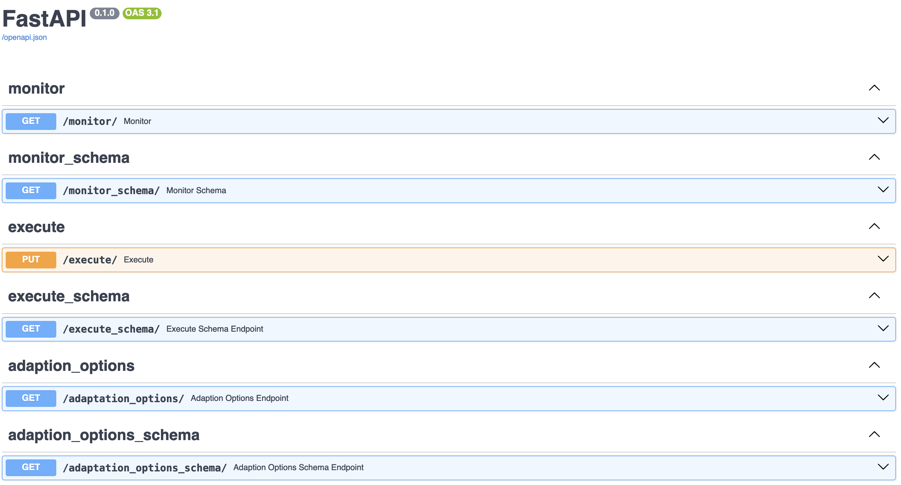

# CrowdNav

## Description

### This branch was used to train the nsga2 found settings via the repo below

https://github.com/JeremyGDiamond/FasCrowdNavNsga

CrowdNav is a simulation based on SUMO and TraCI that implements a custom router
that can be configured using kafka messages or local JSON config on the fly while the simulation is running.
Also runtime data is send to a kafka queue to allow stream processing and logger locally to CSV.

## Dependencies
* Docker
* Docker Compose

## Setup
* Download the CrowdNav code
* Run `docker compose up -d`  to run all the images (CrowdNav, Kafka, API) in detached mode

## Folder structure
* **api**: This contains the HTTP Server which is implemented using FastAPI
  * The API is documented at http://localhost:8080/docs or http://localhost:8080/redoc
* **crowdnav**: This contains CrowdNav

### Available endpoints

  * /monitor (GET): Returns a JSON object with a list of values of everything monitorable about the exemplar. For example, this could include the response time of requests for an exemplar of a web server.
  * /execute (PUT): Executes an adaptation of the exemplar. A JSON object is included in the body of this HTTP request, specifying the adaptation you’d like to enact.
  * /adaptation_options (GET): Returns a JSON object with the adaptation options/adaptation space, these are the configurable aspects of the exemplar/system
  * /monitor_schema (GET): Returns the JSON schema of the JSON object returned by the “monitor” endpoint. 
  * /execute_schema (GET): Returns the JSON schema of the JSON object returned by the “execute” endpoint.
  * /adaptation_options_schema (GET): Returns the JSON schema of the JSON object returned by the “adaptation_options” endpoint.

### Testing endpoints
All the endpoints can be tested using an HTTP client like Postman. For all the GET requests just go to the URL specified in the API docs (e.g. http://localhost:8080/adaptation_options).For the /execute you first have to get a JSON object using a GET request to /adaptation_options and use this object in the body of the PUT request.

### Notes

* To let the system stabilize, no message is sent to kafka or CSV in the first 1000 ticks .

* Errors of the form "Error: Answered with error to command 0xc4: Route replacement failed for car-356" are internal sumo errors that are not of our concern as of now. See this thread for details
https://github.com/eclipse-sumo/sumo/issues/6996 
